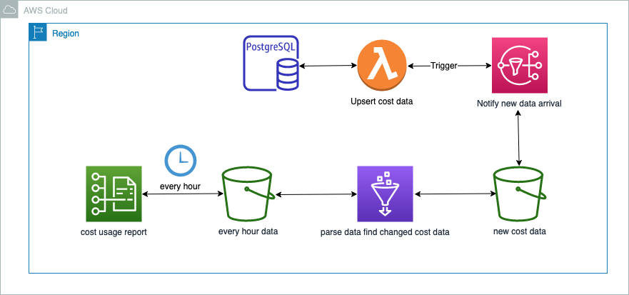

# Cost Usage Report 
This architecture will create cost usage report that will have latest cost data refreshed every one hour. 



## Getting started

```
# if you do not have virtualenv
sudo pip3 install virtualenv
```

Create python virtual environment 

```
virtualenv .venv
```

Activate your virtual environment

```
source .venv/bin/activate
```

Install dependencies 

```
sudo pip3 install -r requirements.txt  
```


Run code 
```
python3 index.py
```# cost-usage-report-aws
